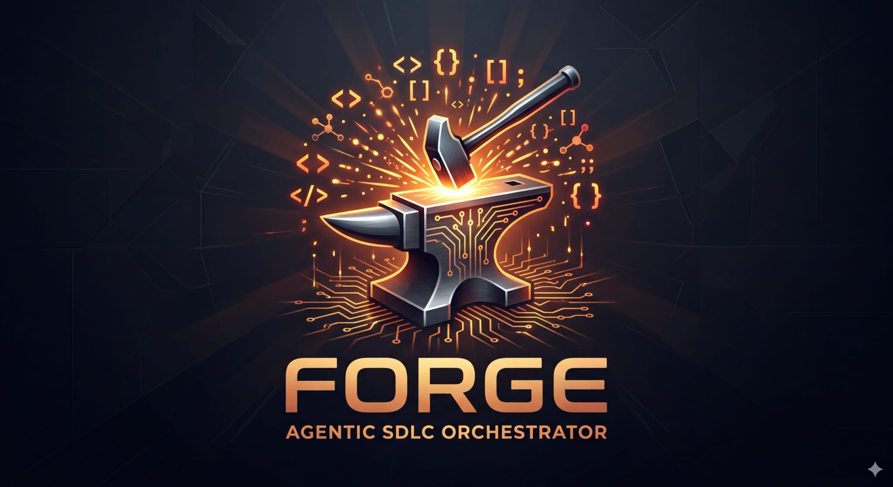

<p align="center">
  
</p>

# Forge - AI-Integrated SDLC Orchestrator

Forge automates the software development lifecycle from Feature ideation through code delivery using AI-powered planning and execution. It connects Jira, GitHub, and Claude to transform tickets into shipped code with human approval gates at each stage.

## How It Works

Forge listens for Jira and github webhooks and orchestrates a multi-stage workflow:

```
┌──────────────────────────────────────────────────────────────────────────────┐
│                            FEATURE WORKFLOW                                   │
├──────────────────────────────────────────────────────────────────────────────┤
│                                                                               │
│  ┌──────────┐   ┌──────────┐   ┌──────────┐   ┌──────────┐                 │
│  │  Create  │──>│ Generate │──>│ Generate │──>│ Decompose│                 │
│  │  Feature │   │   PRD    │   │   Spec   │   │  Epics   │                 │
│  └──────────┘   └────┬─────┘   └────┬─────┘   └────┬─────┘                 │
│                      │              │              │                         │
│                 [Approval]     [Approval]     [Approval]                    │
│                   ↕ Q&A          ↕ Q&A          ↕ Q&A                       │
│                      │              │              │                         │
│                      v              v              v                         │
│                                                                               │
│  ┌──────────┐   ┌──────────┐   ┌──────────┐   ┌──────────┐   ┌──────────┐ │
│  │ Generate │──>│Implement │──>│  Local   │──>│  Create  │──>│  CI/CD   │ │
│  │  Tasks   │   │   Code   │   │  Review  │   │    PR    │   │  + Fix   │ │
│  └────┬─────┘   └──────────┘   └──────────┘   └──────────┘   └────┬─────┘ │
│       │                                                             │        │
│  [Approval]                                                   [AI Review]   │
│    ↕ Q&A                                                           │        │
│       │                                                             v        │
│       v                                                       ┌──────────┐  │
│                                                               │  Human   │──>│
│                                                               │  Review  │   │
│                                                               └──────────┘  │
└──────────────────────────────────────────────────────────────────────────────┘

Q&A: At any approval gate, ask questions with "?" or "@forge ask" prefix
```

## Quick Start

### 1. Prerequisites

- Python 3.11+
- Redis Stack (includes RediSearch module)
- Podman (for code execution containers)
- Jira Cloud account with API access
- GitHub account with Personal Access Token
- Anthropic API key (or Google Vertex AI)

### 2. Installation

```bash
# Clone and install
git clone https://github.com/your-org/forge.git
cd forge
uv sync

# Configure environment
cp .env.example .env
# Edit .env with your credentials (see Configuration section)

# Build the container image
podman build -t forge-dev:latest -f containers/Containerfile containers/
```

### 3. Start Services

Use Docker Compose to start Redis and the API gateway:

```bash
docker compose up redis forge-api -d
```

Then run the worker on the host:

```bash
uv run forge worker
```

> **Why run the worker on the host?** The worker spawns ephemeral Podman containers for task execution. Running it inside a Docker container would require container-in-container access (socket mounting, privileged mode) which is not supported in this setup. Redis and the API gateway have no such requirement and run fine in Docker.

### 4. Configure Webhooks

Set up webhooks in Jira and GitHub pointing to your server:

**Jira Webhook:**
- URL: `https://your-server.com/webhooks/jira`
- Events: Issue created, updated, commented

**GitHub Webhook:**
- URL: `https://your-server.com/webhooks/github`
- Events: Check runs, Pull requests, Pull request reviews

## Usage

### Starting a Feature Workflow

1. **Create a Jira Feature** with the label `forge:managed`
2. Forge automatically generates a PRD and posts it to the ticket
3. **Review and approve** by changing the label to `forge:prd-approved`
4. Forge generates a behavioral specification
5. Continue approving through Spec → Epics → Tasks → Implementation

### Workflow Labels

Use these labels in Jira to control the workflow:

| Stage | Pending Label | Approved Label |
|-------|--------------|----------------|
| PRD | `forge:prd-pending` | `forge:prd-approved` |
| Spec | `forge:spec-pending` | `forge:spec-approved` |
| Plan | `forge:plan-pending` | `forge:plan-approved` |
| Tasks | `forge:task-pending` | `forge:task-approved` |

### Requesting Revisions

Add a comment to the Jira ticket with your feedback. Forge will regenerate the current artifact incorporating your feedback.

### Asking Questions (Q&A Mode)

While reviewing a PRD or Spec, you can ask clarifying questions without triggering regeneration:

- Start your comment with `?` — e.g., `?Why did you choose REST over GraphQL?`
- Or use `@forge ask` — e.g., `@forge ask explain the auth approach`

Forge will answer based on the artifact content and generation context, then keep the workflow paused for your approval decision. When you approve, a summary of Q&A exchanges is posted to the ticket for future reference.

### Handling Failures

When a workflow fails:
1. Forge sets the `forge:blocked` label
2. Forge posts a comment tagging the reporter and assignee
3. To retry: Add the `forge:retry` label — Forge resumes from the exact node that failed, not from the beginning

> **CI-specific:** If CI fix attempts are exhausted, adding `forge:retry` resets the attempt counter so Forge gets a fresh budget of retries.

### Bug Workflow

Bugs follow a simpler workflow:

```
Create Bug → Analyze (RCA) → [Approval + Q&A] → Implement Fix → PR → CI → Review → Done
```

## Workflow Details

### Feature Workflow Stages

| Stage | What Happens | Human Action |
|-------|--------------|--------------|
| **PRD Generation** | AI transforms ticket description into structured PRD | Review, ask questions (?), approve or request changes |
| **Spec Generation** | AI creates behavioral spec with Given/When/Then criteria | Review, ask questions (?), approve or request changes |
| **Epic Decomposition** | AI breaks feature into logical Epics with plans | Review, ask questions (?), approve or request changes |
| **Task Generation** | AI creates implementation Tasks per repository | Review, ask questions (?), approve or request changes |
| **Implementation** | Code executed in ephemeral Podman containers | (Automatic) |
| **Local Code Review** | Reviews the diff against main, fixes breaking issues in-place (up to 2 passes) before PR creation | (Automatic) |
| **PR Creation** | Fork-based pull request created with AI-generated description; PR body synced against commits | (Automatic) |
| **CI Validation** | Pauses until GitHub CI webhook; on failure: runs two-stage analyze-then-fix pipeline (up to 5 retries). Each fix pass is reviewed in-place before push; PR description synced after each push. | (Automatic) |
| **AI Review** | Reviews the PR against the spec after CI passes | (Automatic) |
| **Human Review** | PR ready for human review | Merge or request changes |

### Bug Workflow Stages

| Stage | What Happens | Human Action |
|-------|--------------|--------------|
| **RCA Analysis** | AI analyzes bug and generates root cause analysis | Review, ask questions (?), approve or request changes |
| **Implementation** | Fix implemented in ephemeral container | (Automatic) |
| **PR → CI → Review** | Same as Feature workflow | Merge or request changes |

## Architecture

```
┌─────────────────────────────────────────────────────────────────────────────┐
│                              Forge System                                    │
├─────────────────────────────────────────────────────────────────────────────┤
│                                                                              │
│  ┌──────────────────┐     ┌──────────────────┐     ┌──────────────────┐    │
│  │   FastAPI        │────>│   Redis Queue    │────>│   LangGraph      │    │
│  │   (Webhooks)     │     │   (Event Store)  │     │   (Workflows)    │    │
│  └──────────────────┘     └──────────────────┘     └──────────────────┘    │
│          │                                                   │              │
│          v                                                   v              │
│  ┌──────────────────┐                              ┌──────────────────┐    │
│  │   Jira Client    │                              │  Podman          │    │
│  │   GitHub Client  │                              │  Containers      │    │
│  └──────────────────┘                              └──────────────────┘    │
│                                                              │              │
│                                                              v              │
│                                                     ┌──────────────────┐    │
│                                                     │   Deep Agents    │    │
│                                                     │  (Claude/Gemini) │    │
│                                                     └──────────────────┘    │
└─────────────────────────────────────────────────────────────────────────────┘
```

### Components

- **FastAPI Gateway** - Receives webhooks from Jira and GitHub, validates signatures
- **Redis Queue** - FIFO message queue using Redis Streams for reliable event processing
- **LangGraph Workflows** - State machines for Feature and Bug workflows with checkpointing
- **Podman Containers** - Ephemeral execution environments for code implementation
- **[Deep Agents](https://github.com/deepagents/deepagents)** - AI agent framework powering code implementation, with full tool access (file operations, shell, search). Supports Claude and Gemini as the underlying LLM.

## Configuration

### Required Environment Variables

```bash
# Jira
JIRA_BASE_URL=https://your-org.atlassian.net
JIRA_USER_EMAIL=your-email@example.com
JIRA_API_TOKEN=your-jira-api-token

# GitHub
GITHUB_TOKEN=github_pat_your_token
GITHUB_KNOWN_REPOS=org/repo1,org/repo2
GITHUB_DEFAULT_REPO=org/repo1

# LLM (choose one)
ANTHROPIC_API_KEY=sk-ant-your-api-key  # Direct Anthropic API
# OR
ANTHROPIC_VERTEX_PROJECT_ID=your-gcp-project  # Vertex AI
ANTHROPIC_VERTEX_REGION=us-east5

# Model selection
LLM_MODEL=claude-opus-4-5@20251101

# Redis
REDIS_URL=redis://localhost:6380/0
```

See `.env.example` for the complete list of configuration options including:
- MCP server configuration
- Container resource limits
- Langfuse observability
- Webhook secrets

### MCP Servers

Forge agents can access external tools via MCP (Model Context Protocol):

| Server | Description |
|--------|-------------|
| `github` | GitHub Copilot MCP for repo operations |
| `atlassian` | Atlassian MCP for Jira/Confluence |
| `context7` | Library documentation lookup |
| `gitmcp` | Repository documentation |

Configure in `mcp-servers.json`. By default, MCP tools are read-only.

## Project Structure

```
src/forge/
├── api/                 # FastAPI routes and middleware
├── integrations/        # Jira, GitHub, Agents, Langfuse clients
├── models/              # Domain models (workflow, events)
├── orchestrator/        # Worker and checkpointing
├── workflow/            # Pluggable workflow system
│   ├── base.py         # BaseWorkflow abstract class
│   ├── router.py       # Workflow routing
│   ├── feature/        # Feature workflow implementation
│   ├── bug/            # Bug workflow implementation
│   ├── nodes/          # Workflow node implementations
│   └── gates/          # Human-in-the-loop approval gates
├── prompts/v1/          # Versioned prompt templates
├── queue/               # Redis Streams producer/consumer
├── sandbox/             # Container runner
└── workspace/           # Git operations

containers/              # Container image and entrypoint
tests/                   # Unit and integration tests
```

## API Endpoints

| Endpoint | Method | Description |
|----------|--------|-------------|
| `/health` | GET | Health check |
| `/webhooks/jira` | POST | Jira webhook receiver |
| `/webhooks/github` | POST | GitHub webhook receiver |
| `/metrics` | GET | Prometheus metrics |

## Observability

### Metrics (Prometheus)

- **API server**: `http://localhost:8000/metrics`
- **Worker**: `http://localhost:8001/metrics`

Key metrics:
- `forge_workflows_started_total` - Workflows started by type
- `forge_workflows_completed_total` - Workflows completed
- `forge_ci_fix_attempts_total` - CI fix attempts
- `forge_agent_duration_seconds` - Agent execution time

### Tracing (Langfuse)

All LLM calls are traced to Langfuse when configured:
- PRD/Spec generation traces
- Epic decomposition traces
- Code implementation traces

## Development

```bash
# Run tests
uv run pytest

# Run specific test file
uv run pytest tests/unit/workflow/test_feature.py -v

# Linting
uv run ruff check src/

# Format code
uv run ruff format src/

# Type checking
uv run mypy src/forge/
```

## Testing Locally

Use the sample payloads to simulate Jira webhooks:

```bash
# Start a feature workflow
curl -X POST http://localhost:8000/api/v1/webhooks/jira \
  -H "Content-Type: application/json" \
  -d @tests/payloads/01-feature-created.json

# Approve PRD
curl -X POST http://localhost:8000/api/v1/webhooks/jira \
  -H "Content-Type: application/json" \
  -d @tests/payloads/03-prd-approved.json
```

See `tests/payloads/README.md` for the full sequence.

## Contributing

1. Fork the repository
2. Create a feature branch
3. Make your changes
4. Run tests and linting
5. Submit a pull request
